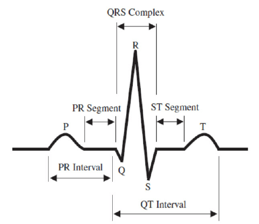
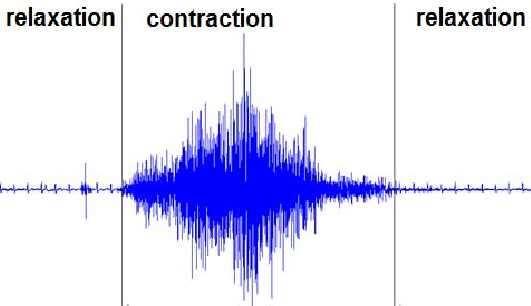
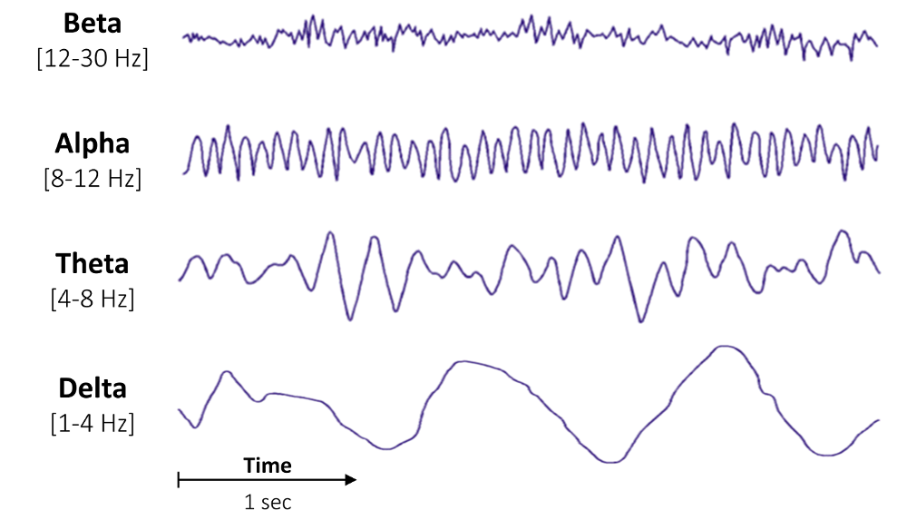
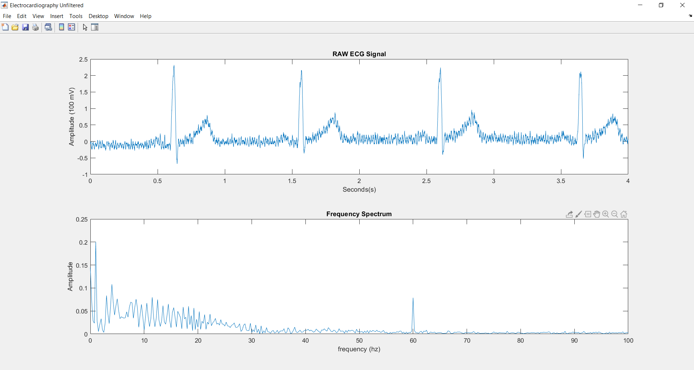
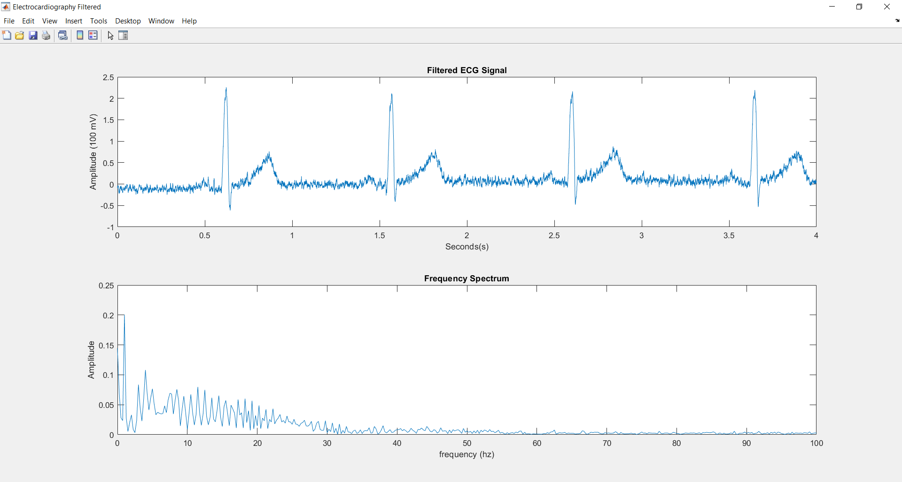
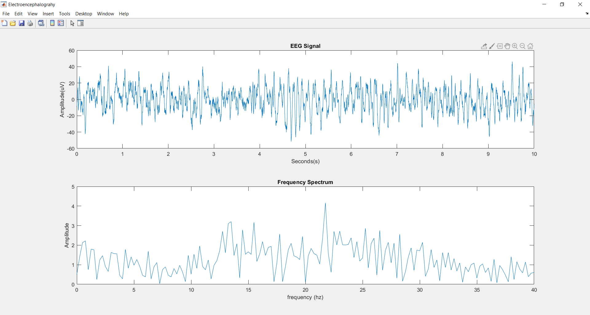

# Body-Signals-Filtering *repository*
This repository holds all the files for the final BMEN 3311 Project.
 

Included Languages:
* MATlab
* Python

## Bio-Signals 
<table style = "width:100%" align="center">
  <th>Electrocardiography (ECG)</th>  
  <th>Electromyography (EMG)</th>
  <th>Electroencephalograhy (EEG)</th> 
  </tr><tr>
  <td></td>
  <td></td>
  <td></td>
  </tr>
  <td>Description of ECG here..  Heart Signal</td>
  <td>Description of EMG here..  Muscle Signal</td>
  <td>Description of EEG here..  Brain Signal</td>
</table>

## Matlab Charts
### ECG Chart Unfiltered

### ECG Chart Filtered

### ECG Chart Unfiltered vs Filtered

### EMG Chart Temp

### EMG Chart Unfiltered

