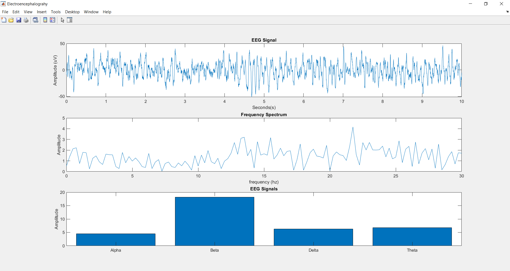

# Body-Signals-Filtering *repository*
This repository holds all the files for the final Biomedical Signal Analysis (BMEN 3311) Project.
 

Included Languages:
* MATlab
* Python

## Bio-Signals 
<table style = "width:100%" align="center">
  <th>Electrocardiography (ECG)</th>  
  <th>Electromyography (EMG)</th>
  <th>Electroencephalograhy (EEG)</th> 
  </tr><tr>
  <td></td>
  <td></td>
  <td></td>
  </tr>
  <td>Description of ECG here..  Heart Signal</td>
  <td>Description of EMG here..  Muscle Signal</td>
  <td>Description of EEG here..  Brain Signal</td>
</table>

### The Project:  
The ECG, EMG, and EEG signals was taken from a patient. The ECG signal was recorded in a .csv file. While the
EMG and EEG signals was recorded in a .txt file with different delimiters.

### Our Assignment:
Load the data from the given files into a MATlab script and plot the data.
Then take the discrete fourier transforms of each signal then plot the
frequency Spectrums. In addition, create a digital notch filter to remove
the noise coming from mains power in the ECG signal without creating a phase shift due to filtering (zero-phase filtering), determine if the patient was tired
during the recording of the EMG signal based on the frequency spectrum of
the EMG signal, and determine the mental state of the patient during the
recording of the EEG signal based on the frequency spectrum of the EEG
signal. Finally, break down how much of the EEG signal is comprised of the
four EEG wave components (Delta, Theta, Alpha and Beta), and display it in a bar graph.

Created by Tyler Adam Martinez  
Date: 12/12/2019

## Matlab Charts
### ECG Chart Unfiltered

### ECG Chart Filtered

### ECG Chart Unfiltered vs Filtered

### EMG Chart

### EEG Chart

